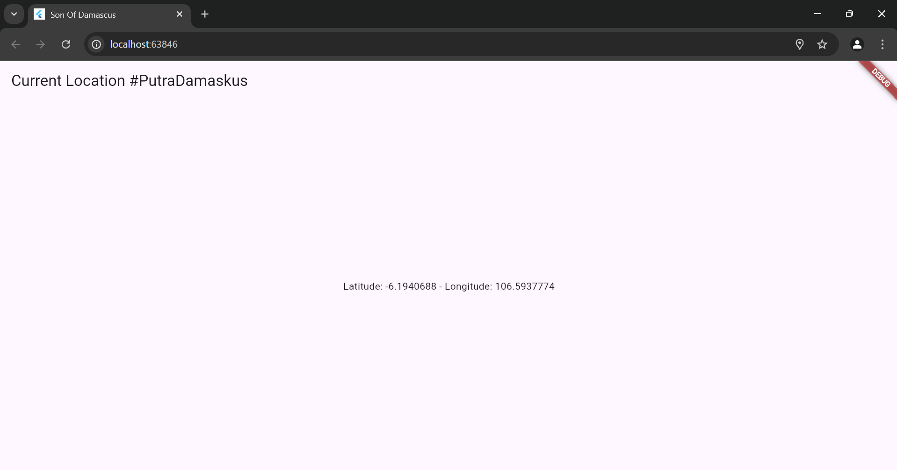

## SOAL 1 PRAKTIKUM 1
- Tambahkan nama panggilan Anda pada title app sebagai identitas hasil pekerjaan Anda.

JAWABAN SOAL


## SOAL 2 PRAKTIKUM 1

- Carilah judul buku favorit Anda di Google Books, lalu ganti ID buku pada variabel path di kode tersebut. Caranya ambil di URL browser Anda seperti gambar berikut ini.


- Kemudian cobalah akses di browser URI tersebut dengan lengkap seperti ini. Jika menampilkan data JSON, maka Anda telah berhasil. Lakukan capture milik Anda dan tulis di README pada laporan praktikum. Lalu lakukan commit dengan pesan "W5: Soal 2"

JAWABAN SOAL 
- DONE
- 

## SOAL 3 PRAKTIKUM 1

- Jelaskan maksud kode langkah 5 tersebut terkait substring dan catchError!
- Capture hasil praktikum Anda berupa GIF dan lampirkan di README. Lalu lakukan commit dengan pesan "W5: Soal 3.

JAWABAN SOAL

Penjelasan Kode Langkah 5
Kode ini merupakan event handler untuk tombol ElevatedButton yang bertugas untuk mengambil data dari Google Books API menggunakan fungsi getData().

1. Fungsi substring(0, 100)
- response.body.substring(0, 100) berarti mengambil 100 karakter pertama dari respon JSON yang didapat dari API.
Ini dilakukan agar tampilan teks tidak terlalu panjang saat ditampilkan di layar.

2. Fungsi catchError((error) {...})
- Jika terjadi error saat melakukan permintaan HTTP (misalnya koneksi gagal, API tidak merespons, atau format data tidak sesuai), maka fungsi catchError akan menangkap error tersebut.
- Error yang ditangkap akan disimpan ke dalam variabel result, lalu ditampilkan sebagai teks dengan pesan:


```kotlin
    An error occurred: <deskripsi error>
```
Ini mencegah aplikasi crash dan memberi tahu pengguna bahwa ada masalah dengan permintaan data.

## SOAL 4 PRAKTIKUM 2

- Jelaskan maksud kode langkah 1 dan 2 tersebut!
- Capture hasil praktikum Anda berupa GIF dan lampirkan di README. Lalu lakukan commit dengan pesan "W5: Soal 4"

JAWABAN
1. Langkah 1: Menambahkan Tiga Method Asynchronous
Pada langkah ini, kita menambahkan tiga fungsi returnOneAsync(), returnTwoAsync(), dan returnThreeAsync().

✅ Penjelasan:

- Setiap method menggunakan Future<int>, yang berarti fungsi ini bersifat asynchronous dan akan mengembalikan nilai integer setelah beberapa waktu.

- await Future.delayed(Duration(seconds: 3)) membuat setiap fungsi menunda eksekusi selama 3 detik sebelum mengembalikan nilai masing-masing (1, 2, dan 3).

- Fungsinya mensimulasikan proses yang memerlukan waktu, seperti mengambil data dari API atau database.

2. Langkah 2: Menggunakan count() untuk Menjumlahkan Nilai
Pada langkah ini, kita menambahkan fungsi count(), yang memanggil ketiga fungsi dari langkah 1 dan menjumlahkan hasilnya.

✅ Penjelasan:

- int total = 0; → Inisialisasi variabel total untuk menyimpan hasil penjumlahan.
- await returnOneAsync(); → Menunggu 3 detik, lalu mendapatkan angka 1.
- await returnTwoAsync(); → Menunggu 3 detik lagi, lalu mendapatkan angka 2.
- await returnThreeAsync(); → Menunggu 3 detik lagi, lalu mendapatkan angka 3.
- Hasil akhirnya adalah 1 + 2 + 3 = 6.
- setState(() { result = total.toString(); }); → Memperbarui UI untuk menampilkan hasil akhir.

KESIMPULAN 

- Langkah 1 membuat tiga fungsi asynchronous yang masing-masing mengembalikan angka setelah 3 detik.
- Langkah 2 menjumlahkan hasil dari ketiga fungsi tersebut dan menampilkannya di layar.
- Total waktu eksekusi adalah 3 + 3 + 3 = 9 detik sebelum hasilnya muncul di UI.

2. Hasil Gif Running aplikasi sementara 
## Screen Capture
GIF Soal 4 Praktikum 2


## SOAL 5 PRAKTIKUM 3

- Jelaskan maksud kode langkah 2 tersebut!
- Capture hasil praktikum Anda berupa GIF dan lampirkan di README. Lalu lakukan commit dengan pesan "W5: Soal 5".

JAWABAN
1. Penjelasan Kode Completer
Kode ini menggunakan Completer, yang memungkinkan kita untuk mengontrol kapan Future akan diselesaikan secara manual.

1.late Completer completer;
Deklarasi variabel completer dengan tipe Completer<int>.

- late berarti variabel akan diinisialisasi nanti sebelum digunakan.
- Completer<int> digunakan untuk membuat sebuah Future yang bisa dikendalikan secara manual.

2.Future getNumber()
```kotlin
Future getNumber() {
  completer = Completer<int>(); // Membuat instance baru dari Completer
  calculate(); // Memanggil fungsi calculate()
  return completer.future; // Mengembalikan future yang akan selesai nanti
}
```
- Membuat Completer<int> baru untuk mengontrol hasilnya.
- Memanggil calculate() untuk memulai perhitungan.
- Mengembalikan completer.future, yang akan selesai ketika calculate() selesai diproses.

3.Future calculate()async
```kotlin
Future calculate() async {
  await Future.delayed(const Duration(seconds: 5));
  completer.complete(42);
}
```
- Menunggu 5 detik (Future.delayed mensimulasikan operasi yang lama, seperti mengambil data dari internet).
- Setelah 5 detik, completer.complete(42); menandakan bahwa Future selesai dengan nilai 42.

Bagaimana Kode Ini Bekerja?
- Ketika getNumber() dipanggil, sebuah Completer baru dibuat.
- Fungsi calculate() dijalankan, tapi tidak langsung mengembalikan hasil.
- Program menunggu selama 5 detik.
- Setelah 5 detik, completer.complete(42); menyelesaikan Future dengan nilai 42.
- Nilai 42 sekarang bisa digunakan di mana pun getNumber() dipanggil.

###
Contoh Pemakaian
Misalnya, jika kita memanggil:
```kotlin
void main() async {
  print('Mengambil angka...');
  int number = await getNumber();
  print('Hasil: $number');
}
```
Output yang dihasilkan
```kotlin
Mengambil angka...
(setelah 5 detik)
Hasil: 42
```

2. Hasil screencapture gif aplikasi


## SOAL 6 PRAKTIKUM 3

- Jelaskan maksud perbedaan kode langkah 2 dengan langkah 5-6 tersebut!
- Capture hasil praktikum Anda berupa GIF dan lampirkan di README. Lalu lakukan commit dengan pesan "W5: Soal 6".

JAWABAN 

1. Perbedaan Kode pada Langkah 2 vs Langkah 5-6

1.kode pada langkah 2
```kotlin
late Completer completer;

Future getNumber() {
  completer = Completer<int>();  // Membuat Completer baru
  calculate();  // Memulai proses perhitungan
  return completer.future;  // Mengembalikan future yang akan diselesaikan nanti
}

Future calculate() async {
  await Future.delayed(const Duration(seconds: 5));  // Menunggu selama 5 detik
  completer.complete(42);  // Future diselesaikan dengan nilai 42
}
```
PENJELASAN 
- getNumber() mengembalikan Future<int> yang akan selesai dalam 5 detik.
- calculate() menunda eksekusi selama 5 detik lalu menyelesaikan Completer dengan nilai 42.
- Tidak ada penanganan error. Jika terjadi error, program bisa crash.

2.kode pada langkah 5(calculate2())
```kotlin
calculate2() async {
    try {
      await Future.delayed(const Duration(seconds: 5));  // Menunggu 5 detik
      completer.complete(42);  // Selesaikan Future dengan nilai 42
    } 
    catch (_) {
      completer.completeError({});  // Jika ada error, selesaikan Future dengan error
    }
}
```
Perbedaan dengan Langkah 2:
- Menambahkan try-catch untuk menangani kemungkinan error.
- Jika terjadi error saat Future.delayed, program tidak crash, tetapi menangani error dengan completeError({}).

3.kode pada langkah 6 (getNumber() dengan then dan catchError)
```kotlin
getNumber().then((value) {
  setState(() {
    result = value.toString();  // Jika sukses, tampilkan hasil
  });
}).catchError((e) {
  result = 'An error occurred';  // Jika error, tampilkan pesan error
});
```
✅ Perbedaan dengan Langkah 2:
- Menggunakan .then() untuk menangani hasil Future.
- Menggunakan .catchError() untuk menangani error, yang tidak ada di Langkah 2.
- Lebih aman dibanding Langkah 2 karena bisa menangani error dari calculate2().

2. Hasil screencapture gif 


## SOAL 7 PRAKTIKUM 4

- Capture hasil praktikum Anda berupa GIF dan lampirkan di README. Lalu lakukan commit dengan pesan "W5: Soal 7".

JAWABAN 

1. Done berhasil gif screencapture 


## SOAL 8 PRAKTIKUM 4

- Jelaskan maksud perbedaan kode langkah 1 dan 4!

JAWABAN

1.Langkah 1: Menggunakan FutureGroup
```kotlin
void returnFG() {
  FutureGroup<int> futureGroup = FutureGroup<int>(); // Membuat FutureGroup
  futureGroup.add(returnOneAsync()); // Menambahkan Future pertama
  futureGroup.add(returnTwoAsync()); // Menambahkan Future kedua
  futureGroup.add(returnThreeAsync()); // Menambahkan Future ketiga
  futureGroup.close(); // Menutup FutureGroup agar mulai dieksekusi

  futureGroup.future.then((List<int> value) {
    int total = value.reduce((sum, element) => sum + element); // Menjumlahkan hasil Future
    setState(() {
      result = total.toString(); // Menampilkan hasil ke UI
    });
  }).catchError((error) { // Menangani error jika terjadi kesalahan
    setState(() {
      result = 'An error occurred: $error';
    });
  });
}
```
- Harus menutup FutureGroup sebelum bisa mendapatkan hasilnya.
- Menangani error secara eksplisit dengan .catchError().
- Lebih kompleks karena memerlukan lebih banyak kode.

Langkah 4: Menggunakan Future.wait()
```kotlin
void returnFG() {
  final futures = Future.wait<int>([
    returnOneAsync(),
    returnTwoAsync(),
    returnThreeAsync(),
  ]);

  futures.then((List<int> value) {
    int total = value.reduce((a, b) => a + b);
    setState(() {
      result = total.toString();
    });
  });
}
```
- Tidak perlu menutup Future.wait(), langsung mengeksekusi semua Future.
- Lebih simpel karena hanya memerlukan satu fungsi untuk mengelola semua Future.
- Tidak menangani error secara eksplisit, tetapi bisa ditambahkan jika diperlukan.

KESIMPULAN
- Jika ingin kode yang lebih bersih dan ringkas, gunakan Future.wait().
- Jika membutuhkan kontrol lebih dalam menangani error dan mengelola Future satu per satu, gunakan FutureGroup.
- Hasil akhir dari kedua metode tetap sama, hanya pendekatan kode yang berbeda.

## SOAL 9 PRAKTIKUM 5

- Capture hasil praktikum Anda berupa GIF dan lampirkan di README. Lalu lakukan commit dengan pesan "W5: Soal 9".

JAWABAN 
Done berhasil running 


## SOAL 10 PRAKTIKUM 5

- Panggil method handleError() tersebut di ElevatedButton, lalu run. Apa hasilnya? Jelaskan perbedaan kode langkah 1 dan 4!

JAWABAN 

Untuk hasil setelah dilakukan running, aplikasi berjalan lancar tanpa ada error dan masih sama seperti screencapture sebelumnya diatas, akan tetapi ada beberapa penjelasan terkait kode nya disini :

🔹 Langkah 1 (returnError)
Fungsi ini hanya bertugas untuk mensimulasikan error. Setelah menunggu selama 2 detik (Future.delayed), ia langsung melempar sebuah Exception. Fungsi ini tidak menangani error-nya sendiri, sehingga jika dipanggil, error tersebut harus ditangani oleh kode pemanggil.

```kotlin
Future returnError() async {
  await Future.delayed(const Duration(seconds: 2));
  throw Exception('Something terrible happened!');  
}
```
🔹 Langkah 4 (handleError)
Fungsi ini digunakan untuk menangani error yang berasal dari pemanggilan returnError(). Di dalamnya terdapat blok try-catch, di mana jika returnError() melempar error, maka error itu ditangkap dan hasilnya ditampilkan ke UI dengan setState. Fungsi ini juga memiliki finally untuk menjalankan perintah tertentu (dalam hal ini, print('Complete')) terlepas dari error terjadi atau tidak.

```kotlin
Future handleError() async {
  try {
    await returnError();
  }
  catch (error) {
    setState(() {
      result = error.toString();
    });
  }
  finally {
    print('Complete');
  }
}
```
- KESIMPULAN
returnError() hanya memicu error, sedangkan handleError() adalah cara untuk menangani error tersebut dengan aman dan menampilkannya ke pengguna. Jadi, returnError() menyebabkan masalah, dan handleError() menyelesaikannya.

## SOAL 11 PRAKTIKUM 6

- Tambahkan nama panggilan Anda pada tiap properti title sebagai identitas pekerjaan Anda

JAWABAN 
1. Done


## SOAL 12 PRAKTIKUM 6

- Jika Anda tidak melihat animasi loading tampil, kemungkinan itu berjalan sangat cepat. Tambahkan delay pada method getPosition() dengan kode await Future.delayed(const Duration(seconds: 3));
- Apakah Anda mendapatkan koordinat GPS ketika run di browser? Mengapa demikian?
- Capture hasil praktikum Anda berupa GIF dan lampirkan di README. Lalu lakukan commit dengan pesan "W5: Soal 12"

JAWABAN 

1. animasi loading sudah tampil dengan durasi awal muncul 3 detik, sebagaimana yang tertampil di GIF

2. Ya, koordinat GPS tetap bisa didapatkan saat menjalankan aplikasi di browser, tetapi ini bergantung pada izin lokasi browser dan kemampuan API Geolocation di web.
Mengapa koordinat bisa didapatkan di browser?

1.Web API Geolocation
- Flutter web menggunakan Geolocation API bawaan browser, bukan sensor GPS langsung seperti di perangkat Android.
- Jika browser memiliki akses ke layanan lokasi (misalnya berdasarkan Wi-Fi atau IP), ia bisa memberikan koordinat perkiraan.

2.Izin Lokasi di Browser
- Saat pertama kali membuka aplikasi di browser, browser akan meminta izin lokasi. Jika Anda menyetujuinya, browser dapat memberikan koordinat.
- Jika izin ditolak, lokasi tidak akan didapatkan, dan kode bisa gagal.

3.Metode Penentuan Lokasi di Browser
- Di Android, Geolocator mendapatkan data dari GPS, Wi-Fi, dan BTS.
- Di browser, lokasi diperoleh dari:
-Wi-Fi (jika tersedia)
-IP Address (jika Wi-Fi tidak tersedia, biasanya kurang akurat)
-Sensor lain jika perangkat mendukung.

Mengapa koordinat bisa sama dengan di Android?
- Jika perangkat yang Anda gunakan untuk mengakses browser memiliki GPS dan browser dapat menggunakannya, hasilnya bisa sama atau mendekati dengan yang didapatkan di Android.
- Namun, jika browser hanya mengandalkan lokasi berdasarkan Wi-Fi atau IP, akurasinya lebih rendah.

Kesimpulan
✔ Ya, koordinat GPS bisa diperoleh di browser karena menggunakan Geolocation API browser.
✔ Browser tidak menggunakan sensor GPS langsung, tapi bisa menentukan lokasi melalui Wi-Fi atau IP Address.
✔ Hasilnya bisa sama atau berbeda dengan Android, tergantung dari metode yang digunakan oleh browser untuk mendapatkan lokasi.



3. hasil screencapture pada perangkat mobile 


## SOAL 13 PRAKTIKUM 7

- Apakah ada perbedaan UI dengan praktikum sebelumnya? Mengapa demikian?
- Capture hasil praktikum Anda berupa GIF dan lampirkan di README. Lalu lakukan commit dengan pesan "W5: Soal 13".
Seperti yang Anda lihat, menggunakan FutureBuilder lebih efisien, clean, dan reactive dengan Future bersama UI.

JAWABAN

1. Tentang perbedaan UI praktikum sebelumnya dengan yang terbaru saat ini (sudah revisi)

- UI Sebelum Revisi (Praktikum Sebelumnya)
Pada kode sebelumnya, UI dibangun berdasarkan hasil getPosition() langsung di dalam initState() dan menyimpan hasilnya ke dalam variabel myPosition yang bertipe String.

```kotlin
@override
void initState() {
  super.initState();
  getPosition().then((Position myPos) {
    myPosition = 'Latitude: ${myPos.latitude} - Longitude: ${myPos.longitude}';
    setState(() {
      myPosition = myPosition;
    });
  });
}

...

final myWidget = myPosition == ''
    ? const CircularProgressIndicator()
    : Text(myPosition);
```
✅ Ciri UI lama:
- Menampilkan CircularProgressIndicator jika data belum ada (myPosition == '').
- Menampilkan text koordinat sebagai String biasa kalau data sudah didapat.
- Tidak ada error handling eksplisit.
- Mengandalkan variabel String myPosition dan manual update setState()

- UI Setelah Revisi (Terbaru Saat Ini)
Pada revisi terbaru, awak dah mengganti pendekatan dengan menggunakan FutureBuilder untuk menangani asynchronous data (Future<Position>).

```kotlin
body: Center(
  child: FutureBuilder(
    future: position,
    builder: (BuildContext context, AsyncSnapshot<Position> snapshot) {
      ...
    },
  ),
)
```
✅Ciri UI baru:
- Menggunakan FutureBuilder: lebih reaktif dan aman.
- Secara otomatis menangani loading, data, dan error tanpa perlu setState() manual.
- Menampilkan CircularProgressIndicator saat loading.
- Menampilkan text data posisi langsung dari snapshot.data saat berhasil.
- Sudah disiapkan tempat untuk menangani error (via snapshot.hasError).
- Tidak lagi menggunakan variabel String myPosition.

- Kesimpulan
UI terbaru jauh lebih baik dan profesional karena memanfaatkan FutureBuilder yang merupakan cara standar di Flutter untuk menangani data asynchronous. Ini juga membuka jalan untuk menambahkan error handling dan loading state dengan cara yang lebih bersih dan reaktif.

2. Hasil Screencapture GIF


## SOAL 14 PRAKTIKUM 7

- Apakah ada perbedaan UI dengan langkah sebelumnya? Mengapa demikian?
- Capture hasil praktikum Anda berupa GIF dan lampirkan di README. Lalu lakukan commit dengan pesan "W5: Soal 14"

JAWABAN

1. Terdapat perbedaan UI antara langkah sebelumnya dan yang terbaru. Pada versi sebelumnya, UI hanya menampilkan teks lokasi setelah data berhasil diambil, tanpa indikator proses pemuatan atau penanganan error. Sedangkan pada versi terbaru, UI menjadi lebih interaktif dan informatif karena menggunakan FutureBuilder. Ini memungkinkan aplikasi menampilkan indikator loading saat menunggu data, pesan error jika terjadi kegagalan, dan data lokasi saat berhasil diperoleh. Hal ini memberikan pengalaman pengguna yang lebih baik karena pengguna tahu apa yang sedang terjadi di dalam aplikasi.

2. Hasil Screencapture GIF


## SOAL 15 PRAKTIKUM 8

- Tambahkan nama panggilan Anda pada tiap properti title sebagai identitas pekerjaan Anda.
- Silakan ganti dengan warna tema favorit Anda.

JAWABAN

1. Done 


## SOAL 16 PRAKTIKUM 8

- Cobalah klik setiap button, apa yang terjadi ? Mengapa demikian ?
- Gantilah 3 warna pada langkah 5 dengan warna favorit Anda!
- Capture hasil praktikum Anda berupa GIF dan lampirkan di README. Lalu lakukan commit dengan pesan "W5: Soal 16".

JAWABAN
1. Ketika tombol di halaman pertama diklik, pengguna diarahkan ke halaman kedua untuk memilih warna. Setelah memilih, warna tersebut dikirim kembali ke halaman pertama dan langsung mengubah warna background-nya. Hal ini terjadi karena `Navigator.pop` mengembalikan nilai, dan `await Navigator.push` menunggu serta menerimanya, lalu `setState` memperbarui tampilan sesuai warna yang dipilih.

Hasil Screencapture 


