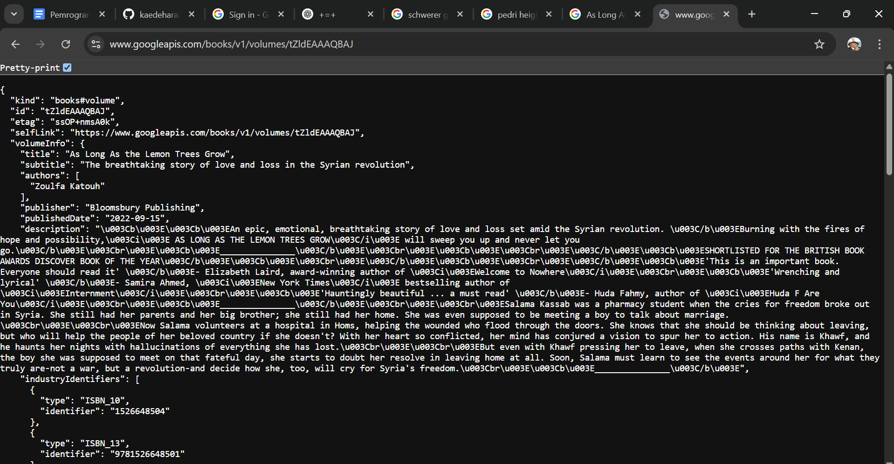

## SOAL 1 PRAKTIKUM 1
- Tambahkan nama panggilan Anda pada title app sebagai identitas hasil pekerjaan Anda.

JAWABAN SOAL


## SOAL 2 PRAKTIKUM 1

- Carilah judul buku favorit Anda di Google Books, lalu ganti ID buku pada variabel path di kode tersebut. Caranya ambil di URL browser Anda seperti gambar berikut ini.


- Kemudian cobalah akses di browser URI tersebut dengan lengkap seperti ini. Jika menampilkan data JSON, maka Anda telah berhasil. Lakukan capture milik Anda dan tulis di README pada laporan praktikum. Lalu lakukan commit dengan pesan "W5: Soal 2"

JAWABAN SOAL 
- DONE
- 

## SOAL 3 PRAKTIKUM 1

- Jelaskan maksud kode langkah 5 tersebut terkait substring dan catchError!
- Capture hasil praktikum Anda berupa GIF dan lampirkan di README. Lalu lakukan commit dengan pesan "W5: Soal 3.

JAWABAN SOAL

Penjelasan Kode Langkah 5
Kode ini merupakan event handler untuk tombol ElevatedButton yang bertugas untuk mengambil data dari Google Books API menggunakan fungsi getData().

1. Fungsi substring(0, 100)
- response.body.substring(0, 100) berarti mengambil 100 karakter pertama dari respon JSON yang didapat dari API.
Ini dilakukan agar tampilan teks tidak terlalu panjang saat ditampilkan di layar.

2. Fungsi catchError((error) {...})
- Jika terjadi error saat melakukan permintaan HTTP (misalnya koneksi gagal, API tidak merespons, atau format data tidak sesuai), maka fungsi catchError akan menangkap error tersebut.
- Error yang ditangkap akan disimpan ke dalam variabel result, lalu ditampilkan sebagai teks dengan pesan:


```kotlin
    An error occurred: <deskripsi error>
```
Ini mencegah aplikasi crash dan memberi tahu pengguna bahwa ada masalah dengan permintaan data.

## SOAL 4 PRAKTIKUM 2

- Jelaskan maksud kode langkah 1 dan 2 tersebut!
- Capture hasil praktikum Anda berupa GIF dan lampirkan di README. Lalu lakukan commit dengan pesan "W5: Soal 4"

JAWABAN
1. Langkah 1: Menambahkan Tiga Method Asynchronous
Pada langkah ini, kita menambahkan tiga fungsi returnOneAsync(), returnTwoAsync(), dan returnThreeAsync().

✅ Penjelasan:

- Setiap method menggunakan Future<int>, yang berarti fungsi ini bersifat asynchronous dan akan mengembalikan nilai integer setelah beberapa waktu.

- await Future.delayed(Duration(seconds: 3)) membuat setiap fungsi menunda eksekusi selama 3 detik sebelum mengembalikan nilai masing-masing (1, 2, dan 3).

- Fungsinya mensimulasikan proses yang memerlukan waktu, seperti mengambil data dari API atau database.

2. Langkah 2: Menggunakan count() untuk Menjumlahkan Nilai
Pada langkah ini, kita menambahkan fungsi count(), yang memanggil ketiga fungsi dari langkah 1 dan menjumlahkan hasilnya.

✅ Penjelasan:

- int total = 0; → Inisialisasi variabel total untuk menyimpan hasil penjumlahan.
- await returnOneAsync(); → Menunggu 3 detik, lalu mendapatkan angka 1.
- await returnTwoAsync(); → Menunggu 3 detik lagi, lalu mendapatkan angka 2.
- await returnThreeAsync(); → Menunggu 3 detik lagi, lalu mendapatkan angka 3.
- Hasil akhirnya adalah 1 + 2 + 3 = 6.
- setState(() { result = total.toString(); }); → Memperbarui UI untuk menampilkan hasil akhir.

KESIMPULAN 

- Langkah 1 membuat tiga fungsi asynchronous yang masing-masing mengembalikan angka setelah 3 detik.
- Langkah 2 menjumlahkan hasil dari ketiga fungsi tersebut dan menampilkannya di layar.
- Total waktu eksekusi adalah 3 + 3 + 3 = 9 detik sebelum hasilnya muncul di UI.

2. Hasil Gif Running aplikasi sementara 
## Screen Capture
GIF Soal 4 Praktikum 2


## SOAL 5 PRAKTIKUM 3

- Jelaskan maksud kode langkah 2 tersebut!
- Capture hasil praktikum Anda berupa GIF dan lampirkan di README. Lalu lakukan commit dengan pesan "W5: Soal 5".

JAWABAN
1. Penjelasan Kode Completer
Kode ini menggunakan Completer, yang memungkinkan kita untuk mengontrol kapan Future akan diselesaikan secara manual.

1.late Completer completer;
Deklarasi variabel completer dengan tipe Completer<int>.

- late berarti variabel akan diinisialisasi nanti sebelum digunakan.
- Completer<int> digunakan untuk membuat sebuah Future yang bisa dikendalikan secara manual.

2.Future getNumber()
```kotlin
Future getNumber() {
  completer = Completer<int>(); // Membuat instance baru dari Completer
  calculate(); // Memanggil fungsi calculate()
  return completer.future; // Mengembalikan future yang akan selesai nanti
}
```
- Membuat Completer<int> baru untuk mengontrol hasilnya.
- Memanggil calculate() untuk memulai perhitungan.
- Mengembalikan completer.future, yang akan selesai ketika calculate() selesai diproses.

3.Future calculate()async
```kotlin
Future calculate() async {
  await Future.delayed(const Duration(seconds: 5));
  completer.complete(42);
}
```
- Menunggu 5 detik (Future.delayed mensimulasikan operasi yang lama, seperti mengambil data dari internet).
- Setelah 5 detik, completer.complete(42); menandakan bahwa Future selesai dengan nilai 42.

Bagaimana Kode Ini Bekerja?
- Ketika getNumber() dipanggil, sebuah Completer baru dibuat.
- Fungsi calculate() dijalankan, tapi tidak langsung mengembalikan hasil.
- Program menunggu selama 5 detik.
- Setelah 5 detik, completer.complete(42); menyelesaikan Future dengan nilai 42.
- Nilai 42 sekarang bisa digunakan di mana pun getNumber() dipanggil.

###
Contoh Pemakaian
Misalnya, jika kita memanggil:
```kotlin
void main() async {
  print('Mengambil angka...');
  int number = await getNumber();
  print('Hasil: $number');
}
```
Output yang dihasilkan
```kotlin
Mengambil angka...
(setelah 5 detik)
Hasil: 42
```

2. Hasil screencapture gif aplikasi


## SOAL 6 PRAKTIKUM 3

- Jelaskan maksud perbedaan kode langkah 2 dengan langkah 5-6 tersebut!
- Capture hasil praktikum Anda berupa GIF dan lampirkan di README. Lalu lakukan commit dengan pesan "W5: Soal 6".

JAWABAN 

1. Perbedaan Kode pada Langkah 2 vs Langkah 5-6

1.kode pada langkah 2
```kotlin
late Completer completer;

Future getNumber() {
  completer = Completer<int>();  // Membuat Completer baru
  calculate();  // Memulai proses perhitungan
  return completer.future;  // Mengembalikan future yang akan diselesaikan nanti
}

Future calculate() async {
  await Future.delayed(const Duration(seconds: 5));  // Menunggu selama 5 detik
  completer.complete(42);  // Future diselesaikan dengan nilai 42
}
```
PENJELASAN 
- getNumber() mengembalikan Future<int> yang akan selesai dalam 5 detik.
- calculate() menunda eksekusi selama 5 detik lalu menyelesaikan Completer dengan nilai 42.
- Tidak ada penanganan error. Jika terjadi error, program bisa crash.

2.kode pada langkah 5(calculate2())
```kotlin
calculate2() async {
    try {
      await Future.delayed(const Duration(seconds: 5));  // Menunggu 5 detik
      completer.complete(42);  // Selesaikan Future dengan nilai 42
    } 
    catch (_) {
      completer.completeError({});  // Jika ada error, selesaikan Future dengan error
    }
}
```
Perbedaan dengan Langkah 2:
- Menambahkan try-catch untuk menangani kemungkinan error.
- Jika terjadi error saat Future.delayed, program tidak crash, tetapi menangani error dengan completeError({}).

3.kode pada langkah 6 (getNumber() dengan then dan catchError)
```kotlin
getNumber().then((value) {
  setState(() {
    result = value.toString();  // Jika sukses, tampilkan hasil
  });
}).catchError((e) {
  result = 'An error occurred';  // Jika error, tampilkan pesan error
});
```
✅ Perbedaan dengan Langkah 2:
- Menggunakan .then() untuk menangani hasil Future.
- Menggunakan .catchError() untuk menangani error, yang tidak ada di Langkah 2.
- Lebih aman dibanding Langkah 2 karena bisa menangani error dari calculate2().

2. Hasil screencapture gif 


